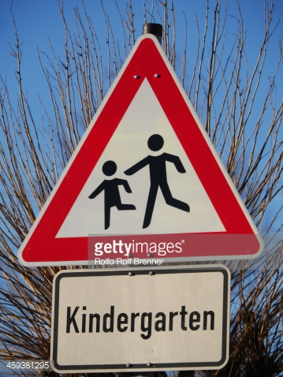
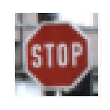
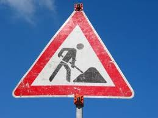

# **Traffic Sign Recognition** 

## Writeup

---

**Build a Traffic Sign Recognition Project**

The goals / steps of this project are the following:
* Load the data set (see below for links to the project data set)
* Explore, summarize and visualize the data set
* Design, train and test a model architecture
* Use the model to make predictions on new images
* Analyze the softmax probabilities of the new images
* Summarize the results with a written report

---
### Writeup / README

#### 1. Provide a Writeup / README that includes all the rubric points and how you addressed each one. You can submit your writeup as markdown or pdf. You can use this template as a guide for writing the report. The submission includes the project code.

You're reading it! and here is a link to my [project code](https://github.com/vengalraoguttha/CarND-Traffic-Sign-Classifier-Project/blob/master/Traffic_Sign_Classifier.ipynb)

### Data Set Summary & Exploration

#### 1. Provide a basic summary of the data set. In the code, the analysis should be done using python, numpy and/or pandas methods rather than hardcoding results manually.

I used the pandas library to calculate summary statistics of the traffic
signs data set:

* The size of training set is 34799
* The size of the validation set is 4410
* The size of test set is 12630
* The shape of a traffic sign image is (32,32,3)
* The number of unique classes/labels in the data set is 43

#### 2. Include an exploratory analysis of the dataset.

Here is an exploratory analysis of the data set. 

Number of images in each class : 
2     2010
1     1980
13    1920
12    1890
38    1860
10    1800
4     1770
5     1650
25    1350
9     1320
7     1290
8     1260
3     1260
11    1170
18    1080
35    1080
17     990
31     690
14     690
33     599
15     540
26     540
28     480
23     450
30     390
34     360
6      360
16     360
22     330
36     330
40     300
20     300
21     270
39     270
24     240
29     240
32     210
42     210
41     210
27     210
37     180
19     180
0      180

observations:
1) class 2 i.e Speed limit (50km/h) has more number of training images where as classes 0, 37, 19 has least training images.
2) nearly number of training images in class 2 is 10 times that of in class 0 
3) the dataset is not balalnced.

### Design and Test a Model Architecture

As a first step,

1) normalized the image using equation x = (x - min(x))/(max(x)-min(x)) 

  -> normalization is used to remove effect of certain domination of high value features

2) agumented the data by flipping images
  -> to make model robust and classify traffic sigals in different orientations scales etc, augmentation process is used.

3) this data is given as input to convolution neural network to get the logits

4) then entropy is calculated using logis and known output

5) using the adam optimizer the mean entropy is reduces

6) used  EPOCHS =50 , BATCH_SIZE =128 

#### 2. Describe what your final model architecture looks like including model type, layers, layer sizes, connectivity, etc.) Consider including a diagram and/or table describing the final model.

My final model consisted of the following layers:

| Layer         		|     Description	        					| 
|:---------------------:|:---------------------------------------------:| 
| Input         		| 32x32x3 RGB image   							| 
| Convolution 5x5     	| 1x1 stride, same padding, outputs 28x28x20 	|
| RELU					|												|
| Max pooling	      	| 2x2 stride,  outputs 14x14x20 				|
| Convolution 5x5	    | 1x1 stride, same padding, outputs 28x28x40.  	|
| Fully connected		| 1000 * 512   									|
| Fully connected		| 512 * 256   									|
| Fully connected		| 256 * 128   									|
| Fully connected		| 128 * 43   									|
| Softmax				| to produce probabilities  					|
|						|												|
|						|												|
 

#### 3. Describe how you trained your model. The discussion can include the type of optimizer, the batch size, number of epochs and any hyperparameters such as learning rate.

To train the model, 
i used EPOCHS = 50 and  BATCH_SIZE =128 
and learning rate of 0.001
-> i even experimented on tensorflow learining rate schedule 

#### 4. Describe the approach taken for finding a solution and getting the validation set accuracy to be at least 0.93. Include in the discussion the results on the training, validation and test sets and where in the code these were calculated. Your approach may have been an iterative process, in which case, outline the steps you took to get to the final solution and why you chose those steps. Perhaps your solution involved an already well known implementation or architecture. In this case, discuss why you think the architecture is suitable for the current problem.

My final model results were:
* validation set accuracy of 95-96%
* test set accuracy of 94.1%

1) First tried with simpel LeNet model but this approach gave me a validation accuracy of 0.85 after 50 epochs.

  so i order to improve this, I tries to first implement the drop out policy with keep_prob = 0.5 and again validated model but accuracy ony reached 0.88. then changed the CNN layers with layer 1 filter to 20 and layer 2 filters to 40 (I assumed that since mnist which has only output classes uses 6 and 16 filters in 2 layers so i felt a need to increase filters if i need to classify 43 classes)
  Then i even changes the fully connected layers slightly as shown in table below, then I got the validation accuracy of 0.95-0.96 and then i stopped training and tested my model I then got a accuracy of 0.941
 

### Test a Model on New Images
#### 1. Choose five German traffic signs found on the web and provide them in the report. For each image, discuss what quality or qualities might be difficult to classify.

Here are five German traffic signs that I found on the web:

  
 

These images can be difficult to classify because of :
1) different resolutions of different images
2) resizing to (32,32,3) leads to some information loss
2) orientation of images might effect if models is not robust.

#### 2. Discuss the model's predictions on these new traffic signs and compare the results to predicting on the test set. At a minimum, discuss what the predictions were, the accuracy on these new predictions, and compare the accuracy to the accuracy on the test set (OPTIONAL: Discuss the results in more detail as described in the "Stand Out Suggestions" part of the rubric).

Here are the results of the prediction:

| Image			        |     Prediction	        					| 
|:---------------------:|:---------------------------------------------:| 
| Stop Sign      		| Stop sign   									| 
| Speed limit (60km/h) 	| Speed limit (60km/h) 							|
| Road work	    		| Road work										|
| Right-of-way at the next intersection| Right-of-way at the next intersection	|
| Children crossing  	| Road work      							|

The model was able to correctly guess 4 of the 5 traffic signs, which gives an accuracy of 80%. This compares favorably to the accuracy on the test set of 94.1%, in the misclassifed image the correct label is in third position on probabilities ranking. this misclassification is done because the resized image is not clear. thus model accuracy on test set and that on above 5 images are aligning.

#### 3. Describe how certain the model is when predicting on each of the five new images by looking at the softmax probabilities for each prediction. Provide the top 5 softmax probabilities for each image along with the sign type of each probability. (OPTIONAL: as described in the "Stand Out Suggestions" part of the rubric, visualizations can also be provided such as bar charts)

The code for making predictions on my final model is located from 14th cell of the Ipython notebook.

For the first image, the model is relatively sure that this is a stop sign (probability of 0.6), and the image does contain a stop sign. The top five soft max probabilities were

| Probability         	|     Prediction	        					| 
|:---------------------:|:---------------------------------------------:| 
| 9.9999750e-01			| Stop sign   									| 
| 2.4739811e-06			| No entry  									|
| 8.5811361e-18			| No passing									|
| 5.0933538e-19			| Speed limit (20km/h)			 				|
| 2.5291962e-19		    | Bumpy road        							|

For the remainig images the results are sown in html genrated.

